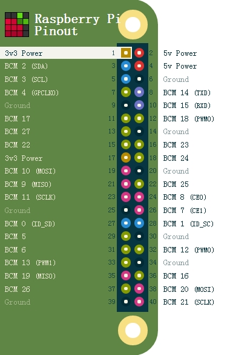

# 树莓派 LCD1602驱动Go语言实现

## 树莓派硬件GPIO示意图


## 硬件连接（从上到下对应LCD1602 1-16号Pin）

| LCD1602 Pin |                          树莓派 Pin                          |
| :---------: | :----------------------------------------------------------: |
|     VSS     |                            Ground                            |
|     VDD     |                           5v Power                           |
|     V0      | 液晶对比度调节，接电位器（需要一个10k电位器）中间的引脚，电位器两边的引脚肥呗接5v和接地。 |
|     RS      |                            BCM14                             |
|     RW      |                            Ground                            |
|     EN      |                            BCM 15                            |
|     D0      |                             悬空                             |
|     D1      |                             悬空                             |
|     D2      |                             悬空                             |
|     D3      |                             悬空                             |
|     D4      |                            BCM 17                            |
|     D5      |                            BCM 18                            |
|     D6      |                            BCM 27                            |
|     D7      |                            BCM 22                            |
|      A      |                           5v Power                           |
|      K      |                            Ground                            |

## Example

```go
package main

import (
    "github.com/qinxin0720/lcd1602"
)

func main() {
    lcd := lcd1602.NewAdafruitCharlcd(14, 15, [4]int{17, 18, 27, 22})
    lcd.Init()
    lcd.Clear()
    lcd.Message(" LCD 1602 Test \n123456789ABCDEF")
}

```

# License

这个项目使用MIT许可